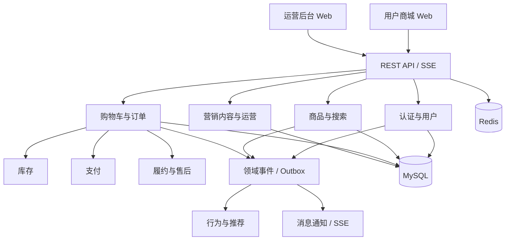

# 系统架构

## 1. 架构决策

一期采用 Spring Boot 模块化单体。业务模块拥有独立的应用服务、领域对象和数据访问层，通过公开接口或领域事件协作，禁止跨模块直接操作数据表。

这一形态兼顾一周交付效率和后续微服务演进：当流量、组织或发布节奏需要时，可优先拆分商品、库存、订单、支付和推荐模块。

## 2. 逻辑架构



## 3. 后端模块

| 模块 | 职责 | 未来拆分优先级 |
|---|---|---|
| identity | 认证、用户、地址、角色权限 | 中 |
| catalog | 类目、品牌、SPU、SKU、搜索 | 高 |
| pricing | 售价、活动价、价格计算 | 中 |
| inventory | 可售、锁定、扣减、库存流水 | 高 |
| cart | 购物车和结算预览 | 低 |
| order | 订单、快照、状态机 | 高 |
| payment | 支付单、回调、退款适配 | 高 |
| fulfillment | 发货、物流和收货 | 中 |
| aftersales | 退款退货流程 | 中 |
| marketing | 优惠券、满减、活动 | 中 |
| content | Banner、专题、文章、推荐位 | 低 |
| engagement | 收藏、足迹、评价 | 中 |
| recommendation | 行为事件、画像、推荐流 | 高 |
| notification | 消息模板、站内信、SSE | 中 |
| analytics | 运营聚合指标 | 高 |

## 4. 分层约束

```text
module/
  api/             HTTP 接口与请求响应模型
  application/     用例编排、事务边界
  domain/          领域对象、规则、领域服务
  infrastructure/  JPA、外部适配器、消息实现
```

- API 层不直接访问 Repository。
- 领域层不依赖 Spring MVC、JPA 实现和外部 SDK。
- 跨模块同步调用只依赖目标模块公开的 Facade。
- 异步副作用通过领域事件和 Outbox 触发。
- 外部支付、物流和对象存储使用端口适配器，可替换 Mock 实现。

## 5. 一致性策略

- 单模块强一致操作使用本地数据库事务。
- 下单使用库存条件更新，避免超卖。
- 支付回调、取消订单和消息消费使用业务幂等键。
- 跨模块副作用写入 Outbox，由后台任务可靠投递。
- Demo 阶段 Outbox 在本进程消费，后续可无缝替换为 Kafka/RabbitMQ。

## 6. 前端架构

- `storefront` 与 `admin-web` 独立构建、独立路由和权限模型。
- 公用 API 类型由 OpenAPI 生成，避免前后端字段漂移。
- 页面按业务域拆分，状态按 server state、session state、UI state 分类。
- 用户端使用自定义设计语言；运营端以高信息密度和效率为主。

