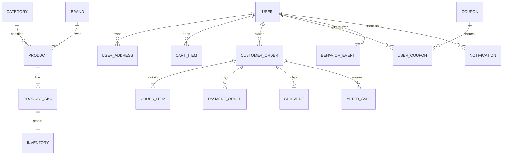

# 数据模型

## 1. 设计原则

- 主键统一使用 `BIGINT`，对外暴露业务编号或不可枚举 ID。
- 金额使用 `DECIMAL(18,2)`，禁止浮点数。
- 核心表包含 `created_at`、`updated_at` 和乐观锁版本号。
- 订单保存商品和价格快照，历史数据不受商品修改影响。
- 状态字段使用稳定代码，展示文案由应用层转换。

## 2. 核心实体关系

## 3. 表清单

| 领域 | 表 |
|---|---|
| 身份 | `users`, `user_addresses`, `roles`, `user_roles`, `refresh_tokens` |
| 商品 | `categories`, `brands`, `products`, `product_skus`, `product_media`, `product_attributes` |
| 库存 | `inventories`, `inventory_reservations`, `inventory_transactions` |
| 购物车 | `cart_items` |
| 订单 | `customer_orders`, `order_items`, `order_status_logs` |
| 支付履约 | `payment_orders`, `payment_callbacks`, `shipments`, `shipment_tracks` |
| 售后 | `after_sales`, `after_sale_logs` |
| 营销 | `promotions`, `coupons`, `user_coupons`, `order_discounts` |
| 内容 | `banners`, `content_articles`, `content_slots`, `content_slot_items` |
| 互动 | `favorites`, `browse_histories`, `product_reviews`, `review_likes` |
| 推荐 | `behavior_events`, `user_preferences`, `recommendation_snapshots` |
| 消息 | `notification_templates`, `notifications`, `notification_deliveries` |
| 平台 | `outbox_events`, `idempotency_records`, `operation_logs` |

## 4. 关键字段

### `product_skus`

`id`, `product_id`, `sku_code`, `name`, `spec_values_json`, `sale_price`, `market_price`, `status`, `version`。

### `inventories`

`sku_id`, `total_quantity`, `reserved_quantity`, `available_quantity`, `warning_quantity`, `version`。

### `customer_orders`

`id`, `order_no`, `user_id`, `status`, `goods_amount`, `discount_amount`, `shipping_amount`, `payable_amount`, `address_snapshot_json`, `expire_at`, `paid_at`, `version`。

### `order_items`

`id`, `order_id`, `product_id`, `sku_id`, `product_name`, `sku_name`, `image_url`, `unit_price`, `quantity`, `discount_amount`, `payable_amount`。

### `behavior_events`

`id`, `user_id`, `anonymous_id`, `event_type`, `target_type`, `target_id`, `context_json`, `occurred_at`。

### `outbox_events`

`id`, `aggregate_type`, `aggregate_id`, `event_type`, `payload_json`, `status`, `retry_count`, `next_retry_at`, `created_at`, `published_at`。

