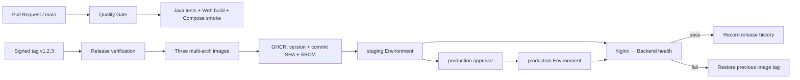

# Aurora Commerce CI/CD 自动化实施方案

## 1. 结论与适用范围

当前最合适的方案是 GitHub Actions + GitHub Container Registry（GHCR）+ 单机 Linux Docker Compose：

- Pull Request 和 `main` 负责持续集成（CI），不产生可部署版本。
- `v*.*.*` Git 标签负责持续交付（CD），重新验证代码并发布三份版本镜像。
- staging 可按仓库变量自动部署；production 必须通过 GitHub Environment 审批。
- staging 使用 `sha-<40位提交哈希>` 定位发布，workflow 再解析三个 registry digest；production 必须复用 staging 摘要中的三个 `@sha256` 引用，确保原样晋级。
- 远端部署失败会自动恢复上一镜像版本，但数据库回滚仍需独立策略。

这套方案适合 Demo、验收和小规模单机部署。未来迁移云平台或 Kubernetes 时，可以保留 CI、版本、镜像和 Environment 审批层，仅替换最后的部署适配器。

## 2. 自动化拓扑



## 3. 已落地的流水线

| 文件 | 触发方式 | 职责 |
|---|---|---|
| `.github/workflows/ci.yml` | PR、推送 `main` | 后端 20 项测试、双端构建、回滚脚本测试、Compose 完整 smoke、失败日志归档 |
| `.github/workflows/release.yml` | 推送 `v*.*.*` 标签 | 重跑后端/前端门禁，构建 amd64/arm64 三镜像，推送版本和 SHA 标签、SBOM、provenance |
| `.github/workflows/deploy.yml` | 手动调用或 release 复用 | 校验镜像、Environment 审批、SSH 传输部署包、远端部署与健康检查 |
| `.github/dependabot.yml` | 每周/月自动 | GitHub Actions、Maven、npm 和基础镜像升级 PR |
| `deployment/deploy.sh` | 目标主机 | 部署锁、拉取、启动、健康检查、历史记录和失败自动回滚 |

CI 使用 concurrency 自动取消同一分支的旧运行，并给各 job 设置超时。Compose 失败日志保留 7 天，避免只能在滚动日志中排查。

## 4. GitHub 仓库配置

### 4.1 Branch protection

在 `Settings → Branches` 为 `main` 配置：

1. Require a pull request before merging。
2. Require status checks：`Backend tests`、`Web production build`、`Compose delivery smoke test`。
3. Require branches to be up to date before merging。
4. 禁止 force push 和删除 `main`。
5. 如团队允许，启用至少一名 reviewer 和 conversation resolution。
6. 使用 Repository ruleset 保护 `v*` 标签，禁止非发布负责人创建、更新或删除。

### 4.2 Environments

在 `Settings → Environments` 创建 `staging` 和 `production`：

- 两个环境都设置变量 `DEPLOY_URL`，用于 Actions 部署记录跳转。
- production 设置 Required reviewers、禁止管理员绕过；可选限制只能从 `v*` 标签部署。
- staging 可不审批；仓库变量 `AUTO_DEPLOY_STAGING=true` 后，版本发布成功会自动部署 staging。
- 未准备服务器时保持 `AUTO_DEPLOY_STAGING` 未设置或为 `false`，镜像发布不会被部署配置阻塞。

每个 Environment 分别配置以下 Secrets：

| Secret | 含义 |
|---|---|
| `DEPLOY_HOST` | Linux 主机域名或 IP |
| `DEPLOY_PORT` | SSH 端口；不设置时使用 22 |
| `DEPLOY_USER` | 无密码 sudo 不是必需的专用部署用户 |
| `DEPLOY_SSH_KEY` | 该用户的 Ed25519 私钥 |
| `DEPLOY_KNOWN_HOSTS` | `ssh-keyscan` 后人工核对的主机公钥记录 |

staging 和 production 即使位于同一主机，也分别使用 `/opt/aurora-commerce-staging` 与 `/opt/aurora-commerce-production`，Compose project、容器和数据卷不会互相覆盖。

## 5. Linux 主机初始化

目标主机建议 Ubuntu 24.04 LTS 或同等级发行版，并具备：Docker Engine、Compose v2、`curl`、`flock`（Ubuntu 的 `util-linux` 包）和出站访问 GHCR 的能力。

以管理员身份一次性准备目录和用户，示例：

```bash
sudo useradd --create-home --shell /bin/bash aurora-deploy
sudo usermod -aG docker aurora-deploy
sudo install -d -o aurora-deploy -g aurora-deploy /opt/aurora-commerce-staging
sudo install -d -o aurora-deploy -g aurora-deploy /opt/aurora-commerce-production
```

为私有 GHCR 镜像创建只具备 `read:packages` 的专用 Token，在服务器以部署用户执行一次 `docker login ghcr.io`。Token 只存放在服务器 Docker credential store，不通过 SSH workflow 传输。

从项目工作区分别上传环境模板并在服务器设置权限：

```bash
scp deployment/release.env.example aurora-deploy@your-host:/opt/aurora-commerce-staging/.env
ssh aurora-deploy@your-host 'chmod 600 /opt/aurora-commerce-staging/.env'
```

production 的 `.env` 必须使用 `SPRING_PROFILES_ACTIVE=prod`；只有 staging/Demo 才可使用 `prod,demo`。两套环境需使用不同数据库密码、JWT Secret、端口和数据卷。

当前 Compose 默认仅绑定 `127.0.0.1`。公网环境应在主机前增加 Caddy、Nginx 或云负载均衡器，终止 HTTPS 后分别代理商城和受访问控制的运营后台。不要为了省事直接公开 MySQL、后端或管理端口。

## 6. 版本发布与环境晋级

确认 `main` Quality Gate 成功后创建签名标签：

```bash
git switch main
git pull --ff-only
git tag -s v0.2.0 -m "Aurora Commerce v0.2.0"
git push origin v0.2.0
```

`Release Images` 将生成：

- `ghcr.io/bizipoopoo/aurora-commerce-backend:v0.2.0`
- `ghcr.io/bizipoopoo/aurora-commerce-storefront:v0.2.0`
- `ghcr.io/bizipoopoo/aurora-commerce-admin:v0.2.0`
- 每个镜像对应的 `sha-<40位提交哈希>` 标签

workflow 会拒绝不在 `origin/main` 历史中的版本标签，防止从未 Review 的临时分支直接发布。

发布摘要会给出 commit SHA 标签。staging 部署把三个标签解析为 registry digest，并在部署摘要中记录完整 `image@sha256:...`。production 应填写同一个 release 以及 staging 摘要中的三个 digest 引用，而不是重新依赖可移动标签或使用 `latest`；workflow 校验完整后才连接服务器。

## 7. 健康检查、回滚与审计

远端脚本部署后从 storefront 容器访问 `/actuator/health`，验证 Nginx 到后端的真实链路，而不是只检查容器进程。

- 成功：更新 `.release`，向 `deployment-history.tsv` 写入 `SUCCESS`。
- 新版本失败：输出容器状态与最近日志，自动部署 `.release` 中的上一版本。
- 回滚成功：写入 `ROLLBACK`，但 GitHub workflow 仍失败，确保故障不会被绿色状态掩盖。
- 无上一版本或回滚也失败：保留日志并要求人工恢复。

手动回滚 staging 可重新输入上一个 `sha-*` 标签；production 还需输入目标版本部署摘要中保存的三个 digest 引用。服务器自动回滚直接使用 `.release-state` 保存的上一组三个 digest，不受标签移动影响。

## 8. 数据库发布边界

容器镜像可以回滚，已经执行的 Flyway migration 不会自动反向执行。正式迭代必须采用 expand/contract：

1. 先增加向后兼容的新表/列，不立即删除旧结构。
2. 发布兼容新旧结构的应用并完成数据回填。
3. 确认旧版本不再需要后，下一版本再删除旧结构。
4. 任何破坏性 migration 前先做可恢复的数据库备份并演练恢复。

如果版本包含无法向后兼容的 migration，应禁用镜像自动回滚，在维护窗口使用数据库恢复 Runbook。当前 Demo schema 仍是向前兼容基线。

## 9. 安全与供应链

- Actions 仅使用当前官方主版本；Dependabot 自动创建升级 PR，由同一 CI 验证。
- Dependabot 日常只提交 minor/patch；框架、JDK、Node 和 TypeScript major 升级按季度单独评估迁移，不混入例行依赖更新。
- 发布 job 的 `packages: write` 是最小权限，普通 CI 只有 `contents: read`。
- BuildKit 为镜像附带最大 provenance 和 SBOM；没有发布 `latest` 标签。
- production Secrets 只绑定 production Environment，并通过审批后才可读取。
- SSH 强制使用已核对的 `known_hosts`，不会使用 `StrictHostKeyChecking=no`。
- 真正的 `.env`、私钥和 GHCR Token 不进入仓库或部署包。

进一步生产化可加入镜像漏洞阈值扫描、OIDC 云身份、签名验证策略、集中日志和部署指标。云厂商确定后，优先用 OIDC 替换长期云密钥。

## 10. 本地与 CI 校验

不需要真实服务器即可验证主要控制逻辑：

```bash
bash scripts/test-deploy.sh
bash -n deployment/deploy.sh scripts/test-deploy.sh
go run github.com/rhysd/actionlint/cmd/actionlint@v1.7.12
```

发布与真实部署只有在 GitHub Environment、服务器和 GHCR 只读登录配置完毕后才能端到端演练。首次演练顺序应为 staging 发布、故意使用错误健康配置验证自动回滚、修复后再次部署，最后再开放 production 审批。

## 11. 研究依据

- [GitHub：Reusable workflows](https://docs.github.com/en/actions/sharing-automations/reusing-workflows)
- [GitHub：Managing deployment environments](https://docs.github.com/en/actions/how-tos/deploy/configure-and-manage-deployments/manage-environments)
- [GitHub：Publishing Docker images](https://docs.github.com/en/actions/how-tos/use-cases-and-examples/publishing-packages/publishing-docker-images)
- [GitHub：Working with the Container registry](https://docs.github.com/en/packages/working-with-a-github-packages-registry/working-with-the-container-registry)
- [GitHub：OIDC security hardening](https://docs.github.com/en/actions/concepts/security/openid-connect)
- [Docker：Build attestations](https://docs.docker.com/build/metadata/attestations/)
